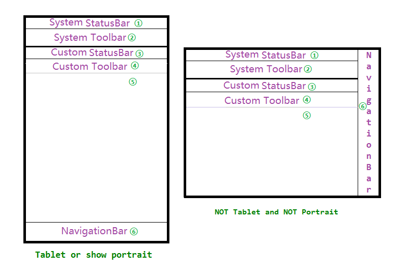
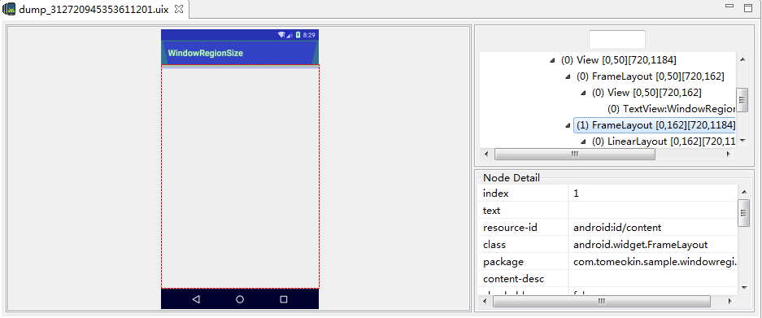
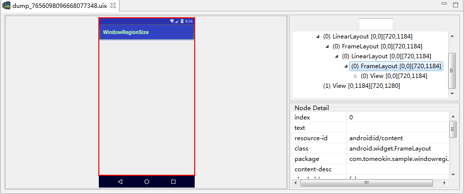
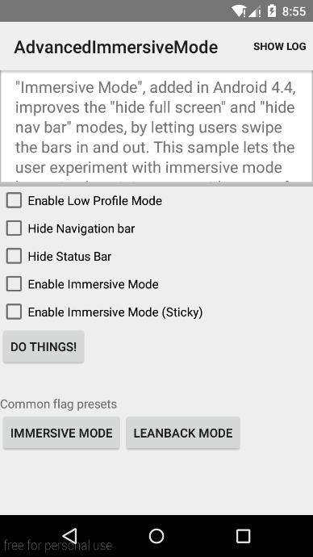
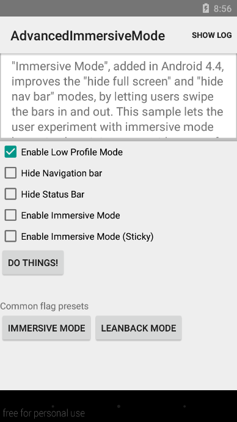
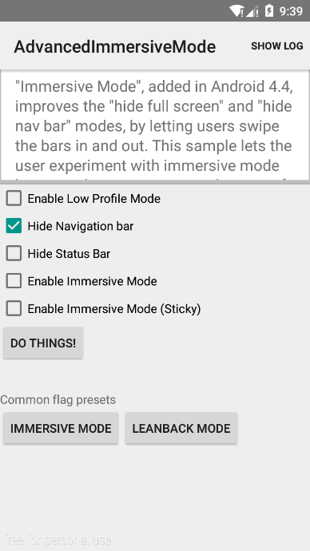
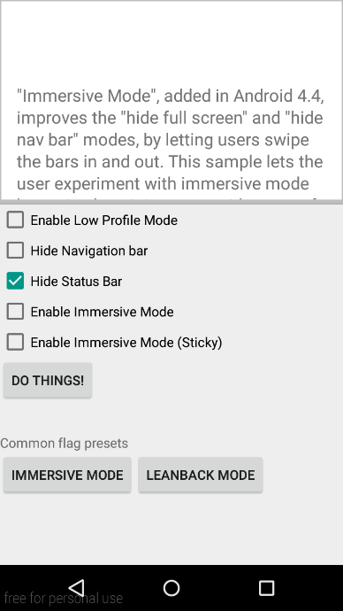
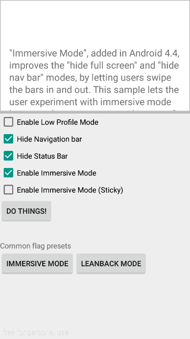
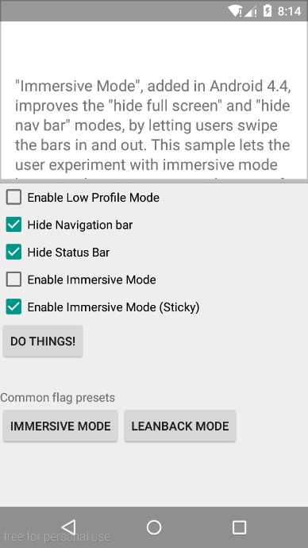

# 安卓界面装饰物的大小计算

## 结构图



### 部件说明

① System StatusBar 系统默认的状态栏

② System Toolbar 主题携带的标题栏（一般更多称为`ActionBar` ，为了体现时代性，本文称为 Toolbar，或者统一描述为 TitleBar）。

③ Custom StatusBar 使用 CoordinatorLayout 携带的状态栏，一般和 ④ 一块使用。

④ Custom Toolbar 当我们不想使用系统的 toolbar 或者需要实现某些效果时，会使用 `Theme.AppCompat.Light.NoActionBar` 之类的主题，并通过 `setSupportActionBar(toolbar)` 添加自定义的 toolbar，为了描述方便，暂且称之为 Custom Toolbar（如果使用系统自动生成的版本，记得将 Toolbar 的 `android:background="?attr/colorPrimary"` 去掉，否则会加剧重绘现象）。

③、④ 和 ⑤ 三部分合起来对应 id 为 `Window.ID_ANDROID_CONTENT` 的 `FrameLayout`。



图 1 使用系统的 ToolBar




图 2 使用自定义的 Toolbar


⑥ NavigationBar 导航栏

指的是虚拟按键，不是实体按键。

StatusBar、ActionBar 和 NavigationBar 合称 `SystemBar` 。


## 为什么要计算这些部件的尺寸呢

理由1：onTouch 中我们拿到的坐标都是从屏幕左上角开始的。有时，在自定义 view 时需要绘制和触摸有关的东西时，我们就需要手动控制绘制的坐标，而绘制的左上角却从 ③ 的左上角开始，坐标为 (0, 0) ，所以需要坐标转换。

其他理由我暂时还不知道，欢迎补充。


## 背景知识补充

1. `DecorView` ：整个界面，在 onCreate() 执行后，可以通过 `getWindow().getDecorView()` 获得，进而获得 Width、Height 大小。在 view 中也可以通过 `getRootView()` 获得。

2. `WindowVisibleDisplayFrame` ：当使用 SystemToolbar 时，包括 ②、③、④、⑤ 四个部分，当使用CustomToolbar 时，包括 ④ 和 ⑤ 两个区域，即除了状态栏和虚拟按键以内的全部区域。这是比较特殊的。可以通过 `getWindow().getDecorView().getWindowVisibleDisplayFrame(rect)` 获得该区域的位置矩形，格式如下：`Rect(0, 50 - 720, 1184)` 。

3. `Window.ID_ANDROID_CONTENT` ：上文提到的，对应的 Framelayout 由 ③、④、⑤ 三部分组成。

   当添加一个 View，包括其父 View 在内，都使用 `match_parent` 标志宽高时，onMeasure() 执行后，我们也可以通过 `getWidth()` 和 `getHeight()` 获得 ③、④、⑤ 三个部分的宽高，不过 `getTop()` 获取到的值为 0 ，这就没什么用。

4. `mWindowManager.getDefaultDisplay().getXX()` ：除了 ⑥ 导航栏以外的全部。提供了 `getWidth()`、`getHeight()` 两个方法来获取大小，从 API 13 起被 deprecated，官方推荐使用 `getSize(out)` 来获取宽高。也可以通过 `getMetrics` 方法间接得到。三种写法如下：

   ```java
   WindowManager wm = (WindowManager) getSystemService(WINDOW_SERVICE);
   Log.i(TAG, "width: " + wm.getDefaultDisplay().getWidth()); // width: 720
   Log.i(TAG, "height: " + wm.getDefaultDisplay().getHeight()); // height: 1184
   ```

   ```java
   Point out = new Point();
   wm.getDefaultDisplay().getSize(out);
   Log.i(TAG, "getSize: " + out.toString()); // getSize: Point(720, 1184)
   ```

   ```java
   DisplayMetrics dm = new DisplayMetrics();
   wm.getDefaultDisplay().getMetrics(dm);
   Log.i("take", "dm.widthPixels: " + dm.widthPixels); // dm.widthPixels: 720
   Log.i("take", "dm.heightPixels: " + dm.heightPixels); // dm.heightPixels: 1184
   ```

5. `wm.getDefaultDisplay().getRealXX()` ：也是整个界面。有两种写法：

   ```java
   Point real = new Point();
   if (Build.VERSION.SDK_INT >= 17) {
     wm.getDefaultDisplay().getRealSize(real);
     Log.i("take", "getRealSize: " + real.toString()); // getRealSize: Point(720, 1280)
   }
   ```

   ```java
   DisplayMetrics dmReal = new DisplayMetrics();
   if (Build.VERSION.SDK_INT >= 17) {
     wm.getDefaultDisplay().getRealMetrics(dmReal);
     Log.i("take", "dmReal.widthPixels: " + dmReal.widthPixels); // dmReal.widthPixels: 720
     Log.i("take", "dmReal.heightPixels: " + dmReal.heightPixels); // dmReal.heightPixels: 1280
   }
   ```

   由于在 API 17 及以上才能使用，还不如直接使用 DecorView 来获取。
6. `uiOptions` ：通过 `getWindow().getDecorView().getSystemUiVisibility()` 获取，包含了一些系统部件的显示状态。也可以使用 `setSystemUiVisability()` 设置 `uiOptions` 。

   我们先看看默认的界面：

   

   ​

   - `SYSTEM_UI_FLAG_LOW_PROFILE` ：淡化状态栏，此时状态栏、虚拟按键颜色会变暗，显示的图标也会变少。Requires API level 14。

     

   - `SYSTEM_UI_FLAG_HIDE_NAVIGATION` ：临时隐藏导航栏，当用户点击屏幕时，导航栏会恢复。

   - `SYSTEM_UI_FLAG_FULLSCREEN` ：隐藏状态栏。显示效果与`WindowManager.LayoutParams.FLAG_FULLSCREEN` 相同。但使用 `SYSTEM_UI_FLAG_FULLSCREEN` 时，如果用户在屏幕顶部下滑时或者切换到其他应用，状态栏会重新显示。而 `WindowManager.LayoutParams.FLAG_FULLSCREEN` 状态则是稳定的，要恢复时需要应用手动清除标志。

     

     当隐藏状态栏时，系统会重新调整界面，这时，状态栏会先变成白条，解决这个问题，有几种方案。一种是使用 Overlay 系列的主题，包括自定义 Toolbar 时给 AppBar 和 ToolBar 加 Overlay 风格的主题。这时当状态栏隐藏时，将状态栏设置为 Toolbar 的颜色，尺寸不变。

     ```xml
     <android.support.design.widget.AppBarLayout
         android:layout_width="match_parent"
         android:layout_height="wrap_content"
         android:theme="@style/AppTheme.AppBarOverlay"
         >

       <android.support.v7.widget.Toolbar
           android:id="@+id/toolbar"
           android:layout_width="match_parent"
           android:layout_height="?attr/actionBarSize"
           app:popupTheme="@style/AppTheme.PopupOverlay"
           />

     </android.support.design.widget.AppBarLayout>
     ```

     另一种是设置 `SYSTEM_UI_FLAG_LAYOUT_FULLSCREEN` 和 `SYSTEM_UI_FLAG_LAYOUT_STABLE` 。前者允许页面的内容显示在 Toolbar 下方，后者使得页面内容尺寸不发生变化。

     同样对于 NavigationBar，也可以设置 `SYSTEM_UI_FLAG_LAYOUT_HIDE_NAVIGATION` 和 `SYSTEM_UI_FLAG_LAYOUT_STABLE` 。

   - `SYSTEM_UI_FLAG_LAYOUT_STABLE` 
   - `SYSTEM_UI_FLAG_LAYOUT_HIDE_NAVIGATION`
   - `SYSTEM_UI_FLAG_LAYOUT_FULLSCREEN`
   - `SYSTEM_UI_FLAG_IMMERSIVE` ：全屏沉浸模式，与 `SYSTEM_UI_FLAG_HIDE_NAVIGATION` 和 `SYSTEM_UI_FLAG_FULLSCREEN` 配合使用。可以通过下拉状态栏或上拉导航栏恢复。

     

     如果只设置了 `SYSTEM_UI_FLAG_HIDE_NAVIGATION` 和 `SYSTEM_UI_FLAG_FULLSCREEN` 则称其为 `LeanBack mode` ，点击屏幕就会恢复。
   - `SYSTEM_UI_FLAG_IMMERSIVE_STICKY` ：粘合全屏沉浸模式，与 `SYSTEM_UI_FLAG_HIDE_NAVIGATION` 和 `SYSTEM_UI_FLAG_FULLSCREEN` 配合使用。可以通过下拉状态栏或上拉导航栏恢复，不过会显示为暗色，点击屏幕或者稍微等待又会回到隐藏状态。

     
   ​

   可以通过设置 `View.OnSystemUiVisibilityChangeListener` 监听系统部件状态的变化。


> 更多的信息，查看：
>
> [Dimming the System Bars | Android Developers](http://developer.android.com/training/system-ui/dim.html)
>
> [Hiding the Status Bar | Android Developers](http://developer.android.com/training/system-ui/status.html)
>
> [Using Immersive Full-Screen Mode | Android Developers](http://developer.android.com/training/system-ui/immersive.html)
>
> [googlesamples/android-BasicImmersiveMode](https://github.com/googlesamples/android-BasicImmersiveMode/)
>
> [googlesamples/android-ImmersiveMode](https://github.com/googlesamples/android-ImmersiveMode/)
>
> [googlesamples/android-AdvancedImmersiveMode](https://github.com/googlesamples/android-AdvancedImmersiveMode) 上两个示例东西很少，可以直接看这个。
>
> [[Android] 关于系统工具栏和全屏沉浸模式](http://www.wossoneri.com/2015/04/12/[Android]%20%E5%85%B3%E4%BA%8E%E7%B3%BB%E7%BB%9F%E5%B7%A5%E5%85%B7%E6%A0%8F%E5%92%8C%E5%85%A8%E5%B1%8F%E6%B2%89%E6%B5%B8%E6%A8%A1%E5%BC%8F/) 


## 部件尺寸的计算

### StatusBar

通过上面的介绍，可以知道，获得当前状态下 StatusBar 的大小，可以使用

```java
Rect rect = new Rect();
getWindow().getDecorView().getWindowVisibleDisplayFrame(rect);
Log.i(TAG, "WindowVisibleDisplayFrame.Top: " + rect.top);
```

由于 StatusBar 的高度对于一个设置而言，也是固定的，可以使用如下方式获取：

```java
int uiOptions = getWindow().getDecorView().getSystemUiVisibility();
if ((uiOptions & View.SYSTEM_UI_FLAG_FULLSCREEN) != View.SYSTEM_UI_FLAG_FULLSCREEN) {
  Log.i(TAG, "show status bar");

  Resources res = getResources();
  int statusBarHeight = 0;
  // com.android.internal.R.dimen.status_bar_height
  int resId = res.getIdentifier("status_bar_height", "dimen", "android");
  if (resId > 0) {
    statusBarHeight = res.getDimensionPixelSize(resId);
  }
  Log.i(TAG, "res.status_bar_height: " + statusBarHeight);
} else {
  Log.i(TAG, "hide status bar");
}
```


### NavigationBar

这个则处理起来相对比较麻烦。

1. 我们需要先检查设备是否有 NavigationBar。

   ```java
   public void checkNavigationBar() {
     Resources res = mView.getResources();
     int idShow = res.getIdentifier("config_showNavigationBar", "bool", "android");
     if (idShow > 0) {
       mHasNavigationBar = res.getBoolean(idShow);

       try {
         Class<?> systemPropertiesClass = Class.forName("android.os.SystemProperties");
         Method m = systemPropertiesClass.getMethod("get", String.class);
         String navBarOverride = (String) m.invoke(systemPropertiesClass, "qemu.hw.mainkeys");
         if ("1".equals(navBarOverride)) {
           mHasNavigationBar = false;
         } else if ("0".equals(navBarOverride)) {
           mHasNavigationBar = true;
         }
       } catch (Exception e) {
       }
     }
   }
   ```

2. 检查是否显示 NavigationBar。

```java
public boolean showNavigationBar() {
  // must getRootView, otherwise is value will not be refresh instantly
  int uiOptions = mView.getRootView().getSystemUiVisibility();
  return (uiOptions & SYSTEM_UI_FLAG_HIDE_NAVIGATION) != SYSTEM_UI_FLAG_HIDE_NAVIGATION;
}
```

注意哦，这里必须使用 `getRootView()` 来获得 uiOptions，否则拿到的是当前 View 缓存的副本，不一定是最新的状态，更加详细的描述，建议查看 [罗升阳](http://my.csdn.net/Luoshengyang) 老师的[Android窗口管理服务WindowManagerService计算Activity窗口大小的过程分析](http://blog.csdn.net/luoshengyang/article/details/8479101)

在讲第 3 步前，需要先穿插点背景知识。

还记得文章一开头的结构图吗？对，NavigationBar 的位置不是固定的。

